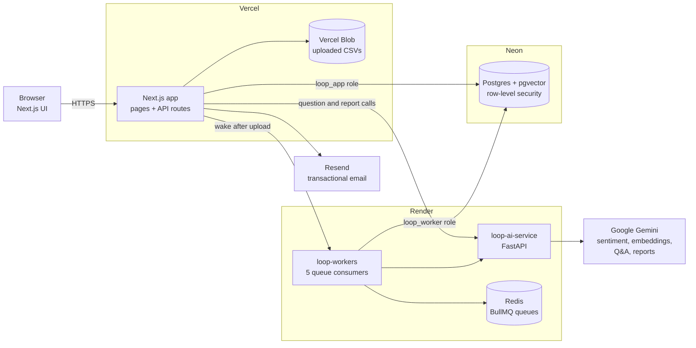
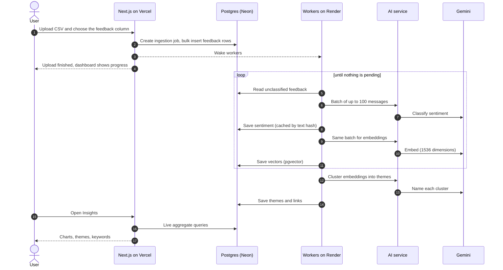
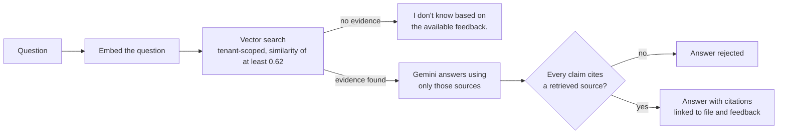
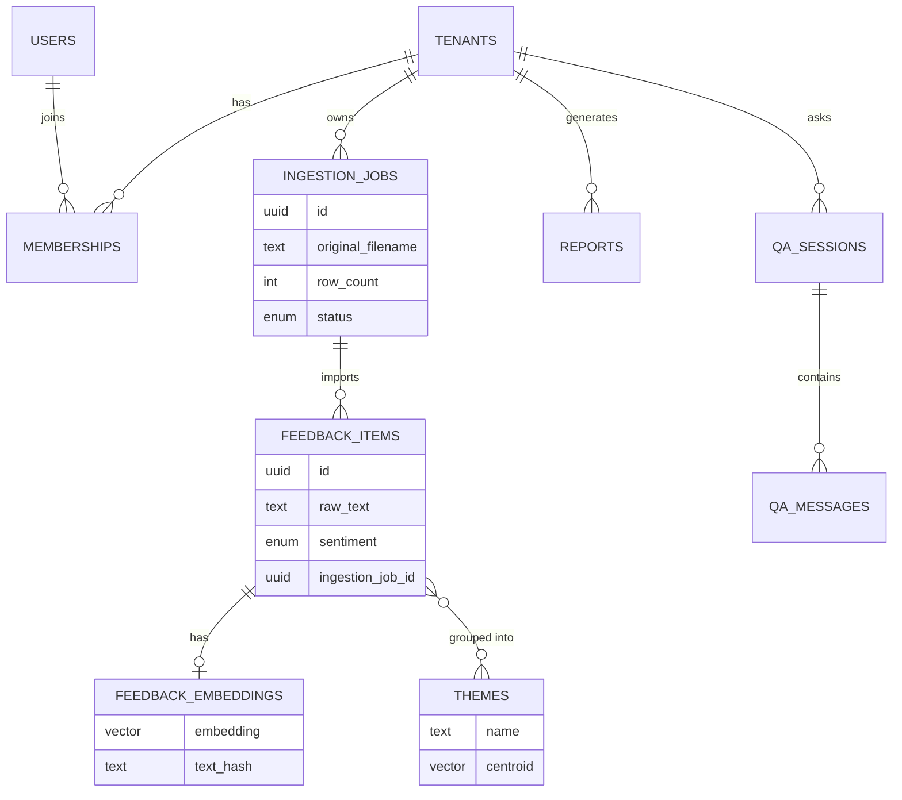

# Project LOOP

**LOOP turns customer feedback files into quick, trustworthy insight.** Upload a CSV of reviews, survey answers or support comments and LOOP classifies the sentiment, groups the feedback into themes, shows what customers talk about most, and lets you ask questions about it in plain language, with every answer tied back to the file and the feedback it came from.

**Developers:** Sonia and Purnima

## Live demo

| What | URL |
|---|---|
| **Web app** (start here) | https://project-loop-two.vercel.app |
| Web API health check | https://project-loop-two.vercel.app/api/health |
| AI service health check | https://loop-ai-service-801c.onrender.com/health |
| Background workers health check | https://loop-workers.onrender.com/health |

> **Free hosting note:** the AI service and workers run on Render's free plan and sleep when idle. The first request after a quiet period can take 30 to 60 seconds while they wake up. The web app wakes the workers automatically after every upload.

**Try it in two minutes**
1. Open the web app, choose **Create a workspace** and sign up.
2. Go to **Upload CSV**, pick a `.csv` file, name the dataset and choose the column that holds the feedback text.
3. Open **Insights**. A progress panel shows sentiment, meaning and themes being processed, and the charts fill in as results arrive.
4. Use the **File** dropdown to see one file on its own or all files together.
5. Open **Ask LOOP** and ask, for example, "What do customers complain about most?". Each answer cites the file and feedback it used.

## What LOOP does

| Feature | What you get |
|---|---|
| **CSV upload** | Workspace admins upload a file (up to 50 MB) and pick the feedback column. Only that column is imported. |
| **Sentiment** | Every item is labelled positive, neutral or negative by Gemini, with results cached so identical text is classified once. |
| **Themes** | Feedback is clustered by meaning (HDBSCAN on Gemini embeddings) and each cluster is named in plain language. |
| **Analytics dashboard** | Sentiment split, net sentiment score, sentiment by file, top themes, biggest pain points and strengths, top keywords, and a time trend when data spans several days. |
| **File-wise analytics** | View all files together or a single uploaded file. Deleting a file also deletes its feedback and analytics. |
| **Feedback inbox** | Search and filter by file, sentiment and theme; open any item for full detail. |
| **Ask LOOP** | Grounded question answering. Every claim carries a citation; with no evidence it answers "I don't know based on the available feedback." |
| **Reports** | On-demand or scheduled (weekly or monthly) executive summaries, shareable by expiring public link and downloadable as PDF. |
| **Team and security** | Roles (admin, editor, viewer), invitations by email, password reset, and per-tenant data isolation enforced in the database. |

## How it works

### System architecture



### From upload to insight



### Asking a question



### Data model



## Tech stack

| Layer | Technology |
|---|---|
| **Frontend** | Next.js 16 (App Router), React 19, TypeScript, Tailwind CSS 3, Recharts, lucide-react |
| **Backend API** | Next.js route handlers (Node.js runtime), JWT authentication with bcrypt password hashing |
| **Background jobs** | BullMQ on Redis: sentiment, embeddings, themes, analytics refresh and report scheduling workers (`apps/web/workers`) |
| **AI service** | Python 3.11, FastAPI, Uvicorn, HDBSCAN, scikit-learn, NumPy |
| **AI models** | Google Gemini (`gemini-3.5-flash-lite` for text, `gemini-embedding-001` at 1536 dimensions for vectors) |
| **Database** | PostgreSQL 16+ with pgvector (HNSW cosine index) and row-level security for tenant isolation |
| **File storage** | Vercel Blob (local disk in development) |
| **Email** | Resend |
| **PDF reports** | Headless Chromium |
| **Testing and quality** | Node test runner integration tests against real Postgres, ESLint, TypeScript, Ruff, mypy, gitleaks |
| **CI/CD** | GitHub Actions (CI on every push and pull request; manual Vercel preview deploy) |
| **Hosting** | Vercel (web), Render (AI service, workers, Redis), Neon (Postgres). Docker Compose for local development. |

## Repository layout

```text
apps/
  web/          Next.js app: pages, API routes, workers, server libraries, tests
  ai-service/   FastAPI service that wraps Gemini and HDBSCAN
packages/
  database/     SQL migrations and the migration runner
infra/          Database role script and deployment notes
docs/           Operations guide and PII/LLM policy
render.yaml     Render blueprint for the background workers
vercel.json     Vercel function settings
docker-compose.yml   Full local stack
```

## Run locally

Prerequisites: Docker Desktop (or Docker Engine with Compose) and Node.js 20+.

```powershell
Copy-Item .env.example .env
docker compose up --build
```

Open `http://localhost:3000`. Health checks:

- Web API: `http://localhost:3000/api/health`
- AI service (private to the Compose network): `docker compose exec ai-service python -c "import urllib.request; print(urllib.request.urlopen('http://localhost:8000/health').read())"`

For host-based development run `npm install` at the repository root, start Postgres with `docker compose up -d postgres`, then `npm run migrate` and `npm run dev`. The AI service can be run on its own with `pip install -r apps/ai-service/requirements.txt` and `uvicorn app.main:app --app-dir apps/ai-service --reload`.

Set `GEMINI_API_KEY` in `.env` to enable sentiment, themes, Q&A and reports.

### Configuration

| Variable | Used by | Purpose |
|---|---|---|
| `DATABASE_URL` | Web | Unprivileged `loop_app` Postgres connection |
| `DATABASE_WORKER_URL` | Workers only | Privileged `loop_worker` connection (bypasses row-level security; never give it to the web app) |
| `REDIS_URL` | Web, workers | BullMQ queues |
| `AI_SERVICE_URL`, `AI_SERVICE_TOKEN` | Web, workers, AI service | Where the AI service lives and the shared secret; the token must match everywhere |
| `GEMINI_API_KEY`, `GEMINI_GENERATION_MODEL`, `GEMINI_EMBEDDING_MODEL` | AI service | Google Gemini access and models |
| `JWT_SECRET` | Web | Signs session tokens |
| `BLOB_READ_WRITE_TOKEN` | Web | Vercel Blob storage for uploaded CSVs |
| `RESEND_API_KEY`, `EMAIL_FROM` | Web | Transactional email. `EMAIL_FROM` must look like `LOOP <noreply@your-verified-domain>` |
| `APP_URL` | Web | Public URL used in emailed links |
| `WORKER_WAKE_URL` | Web | URL of the workers service, pinged after an upload to wake a sleeping free instance |
| `CRON_SECRET` | Web | Bearer token for internal scheduler endpoints |

## Deployment

| Component | Platform | How it deploys |
|---|---|---|
| Web app and API | Vercel | `npx vercel deploy --prod` (project root is linked) |
| Workers | Render web service `loop-workers` | Docker image built from `apps/web/Dockerfile`; runs all five consumers via `apps/web/workers/all.ts` and serves `/health` |
| AI service | Render web service `loop-ai-service` | Docker image built from `apps/ai-service/Dockerfile` |
| Redis | Render Key Value (`loop-redis`) | Managed |
| Database | Neon Postgres | Run `npm run migrate`, then `infra/database-roles.sql` as the admin |

Give the Vercel project only the unprivileged `DATABASE_URL`. Give `DATABASE_WORKER_URL` only to the workers. See [infra/README.md](infra/README.md) and [docs/OPERATIONS.md](docs/OPERATIONS.md).

## How the pipeline behaves

- **Upload:** rows are bulk-inserted in chunks of 1,000, so a large file imports in a second or two.
- **Sentiment and embeddings:** the workers scan every 10 seconds and keep going until nothing is pending. Results are written in bulk. After a Gemini rate limit (free tier: 100 embedding requests per minute) they pause 45 seconds and resume.
- **Themes:** clustering is queued a few seconds after embeddings finish, and re-runs weekly. A theme is reused when its centroid is at least 0.90 similar to an earlier one, so stable themes keep their names. A theme needs at least 3 items.
- **Analytics:** computed live from the feedback table, so charts update the moment data changes and deleting a file removes its numbers immediately.
- **Progress:** the Insights page polls `/api/analytics/status` and shows three steps (reading sentiment, understanding meaning, grouping themes) until analysis completes.

## API overview

All endpoints are tenant-scoped and require a bearer token unless noted.

| Area | Endpoints |
|---|---|
| Auth | `POST /api/auth/signup`, `/login`, `/refresh`, `/password-reset/request`, `/password-reset/confirm` |
| Uploads | `POST /api/ingestions`, `PUT /api/ingestions/:jobId/upload`, `GET /api/ingestions`, `DELETE /api/ingestions/:jobId` (also deletes the file's feedback and analytics) |
| Feedback | `GET /api/feedback` (filters: `jobId`, `sentiment`, `themeId`, `q`), `GET /api/feedback/:id`, `GET /api/themes` |
| Analytics | `GET /api/analytics/trend`, `/themes`, `/files`, `/keywords`, `/status`, each with an optional `?jobId=` to scope to one file |
| Ask LOOP | `POST /api/qa/retrieve`, `POST /api/qa/answer`, `GET /api/qa/sessions/:id` |
| Reports | `POST /api/reports`, `GET /api/reports`, `POST /api/reports/:id/share`, `GET /api/reports/:id/pdf`, `PUT /api/report-schedule`, `GET /api/public/reports/:token` (public) |
| Team | `GET/POST /api/members`, `PATCH/DELETE /api/members/:id`, `POST /api/invitations/accept` |
| Health | `GET /api/health` (public) |

## Quality and security

- **CI** runs migrations, a dependency audit, gitleaks secret scanning, lint, typecheck, tests and a production build for the web app, plus Ruff, mypy and unit tests for the AI service.
- **Tests:** `npm test` runs integration tests against a real Postgres (start one with `docker compose up -d postgres`). They cover tenant isolation, protected routes, file-scoped analytics, deletion cascades, and file-name sources.
- **Tenant isolation:** every table uses Postgres row-level security keyed on the workspace, and queries also filter by tenant explicitly.
- **Privacy:** feedback is redacted for emails, phone numbers, card numbers and labelled personal fields before it is sent to any model. See [docs/PII-LLM-POLICY.md](docs/PII-LLM-POLICY.md).

## Known limits

- The free Render instances cold-start (30 to 60 seconds) and Gemini's free tier rate-limits large uploads, so very large files process in stages. The progress panel shows where analysis is.
- Resend's `onboarding@resend.dev` test sender only delivers to the account owner's address. Verify a domain in Resend to email other people.
- Themes need at least 3 similar items; very small files may show none.
- Keyword extraction ignores common filler words but is not a full language model.

## Credits

Built by **Sonia** and **Purnima**.
