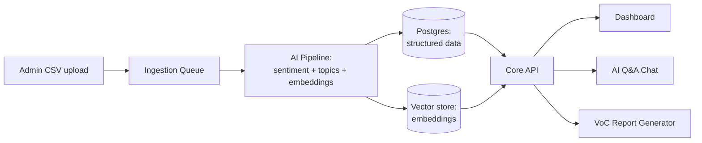

# Project LOOP — Product Plan

*As of 2026-09-17*

## Executive Summary

Customer feedback today is scattered across support tickets, NPS/CSAT surveys, app store reviews, sales calls, and social — no one reads all of it, so patterns only surface after they've already cost renewals. Project LOOP is a multi-tenant SaaS platform that ingests feedback from every channel into one system, uses AI to classify sentiment and surface recurring themes and emerging trends, and lets teams ask questions about their customers in plain English. It is built for product, support, and leadership teams who need faster, evidence-based answers to "what are customers actually telling us" without manually reading thousands of tickets and reviews.

## Goals & Success Metrics

**Business goals:** cut the time it takes a team to go from raw feedback to an actioned insight, increase the share of feedback that actually gets reviewed, and give leadership a defensible, data-backed view of customer sentiment.

| Metric | Why it matters | MVP target |
| --- | --- | --- |
| Time from feedback ingested → categorized | Speed to insight | < 5 minutes (automated) |
| % of feedback volume reviewed/tagged | Coverage vs. today's manual sampling | 100% (vs. a fraction manually today) |
| Weekly active dashboard users per tenant | Adoption | ≥ 3 per tenant |
| VoC reports generated per tenant per month | Value delivered to leadership | ≥ 1 |
| AI Q&A queries answered correctly (spot-checked) | Trust in the AI layer | ≥ 85% judged accurate |

## Target Users & Personas

| Persona | Role | What they need from LOOP |
| --- | --- | --- |
| Priya, Product Manager | Prioritizes roadmap | Themes and trends ranked by volume/impact to justify what to build next |
| Sam, Support Lead | Runs the support team | Sentiment spikes and recurring complaint categories to triage and staff around |
| Lee, Head of CX / Exec | Reports to leadership | A monthly Voice-of-Customer report they can hand to the board without building it themselves |
| Alex, Org Admin | Manages the account | Role-based access, secure multi-tenant setup, control over who sees what |

Primary market at launch: B2B SaaS companies (50–1000 employees) with enough feedback volume across channels that manual review has stopped scaling.

## MVP Feature Scope

1. **CSV ingestion** — workspace admins upload customer-feedback CSV files and select the review-text column.
2. **AI sentiment classification** — positive / neutral / negative per feedback item, run automatically on ingest
3. **AI theme/topic tagging** — automatic clustering of feedback into recurring topics, no manual tagging required
4. **Centralized feedback inbox** — searchable, filterable list (by channel, sentiment, date, theme)
5. **Analytics dashboard** — sentiment trend over time, top themes by volume, feedback volume by channel
6. **Multi-tenant architecture** — hard data isolation per organization
7. **Role-based access control** — Admin, Editor, Viewer roles
8. **Authentication** — email/password. Google OAuth is explicitly deferred to Phase 2, when a production identity-provider configuration and account-linking policy are available.
9. **AI Q&A** — ask a question about the feedback corpus in natural language, get an answer with citations back to source feedback
10. **Automated Voice-of-Customer reports** — scheduled (weekly/monthly) shareable report summarizing sentiment, themes, and trends

## Phase 2+ Features

- Anomaly/spike detection with alerting (e.g. sudden rise in negative sentiment for a theme)
- Additional integrations: Slack, Salesforce, G2/Trustpilot/app stores, an embeddable in-app feedback widget SDK
- Human-in-the-loop tagging corrections that retrain/improve the AI classifier over time
- Advanced access control: custom roles, SSO/SAML, audit logs
- Google OAuth and account linking
- Slack/Teams/email digest notifications
- Third-party integrations and public APIs are deferred until after the CSV-only launch.
- Multi-language feedback support
- Predictive signals linking feedback sentiment to churn risk

## Out of Scope (Non-Goals)

- **Not a helpdesk/ticketing system** — LOOP analyzes uploaded feedback; it does not replace support tooling.
- **Not a survey builder** — LOOP imports CSV exports rather than building survey design tools.
- **No native mobile apps at MVP** — responsive web only
- **No on-prem/self-hosted deployment at MVP** — cloud SaaS only
- **No real-time streaming analytics at MVP** — near-real-time (minutes, not seconds) is sufficient for the target use cases

## Recommended Tech Stack

| Layer | Choice | Why |
| --- | --- | --- |
| Frontend | React + TypeScript, Next.js, Tailwind, shadcn/ui, Recharts | Fast to build dashboards; SSR helps report/share pages load fast |
| Core API | Next.js Route Handlers, TypeScript, deployed as Vercel Functions | Co-locates the product API with the web app; Vercel handles HTTPS, scaling, previews, and serverless execution |
| AI/NLP pipeline | Python (FastAPI) microservice | Python has the strongest ecosystem for embeddings, clustering, and LLM orchestration; keeps AI logic decoupled from core API |
| LLM | Google Gemini API | Sentiment classification, theme summarization, the AI Q&A layer, and Voice-of-Customer report generation |
| Embeddings / semantic search | Gemini Embedding + pgvector or a dedicated vector DB (Pinecone/Qdrant) | Powers the AI Q&A citations and semantic clustering of themes |
| Primary database | PostgreSQL | Relational integrity for tenants/users/roles; row-level security enforces tenant isolation at the DB layer |
| Async jobs / queue | Redis + BullMQ (Node) or Celery (Python) | Ingestion and AI classification run asynchronously so uploads do not block |
| Auth | Clerk or Auth0 for MVP | Multi-tenant auth and RBAC out of the box; SSO/SAML addable later without a rewrite |
| Infra | Vercel + managed Postgres/Redis + worker host | Vercel deploys the web/API from Git; Postgres, Redis, and long-running AI workers remain managed external services |
| Observability | Sentry (errors) + Datadog (metrics/logs) | Multi-tenant systems need to catch tenant-specific failures fast |
| CI/CD | GitHub Actions | Standard, integrates cleanly with the rest of the stack |

This is a two-service split (Node core API + Python AI service) rather than one monolith — it costs a bit of integration overhead up front but avoids forcing all AI/ML work through Node's weaker ML ecosystem, and avoids forcing all product CRUD work through Python's weaker web-framework ergonomics.

## High-Level Architecture

Feedback flows in through administrator CSV uploads, gets classified and embedded asynchronously, and lands in two stores: Postgres for structured records and a vector store for semantic search that powers the AI Q&A and reports.

Every table in Postgres carries a `tenant_id`, enforced via row-level security, so one tenant's feedback can never leak into another's query results. The vector store keeps a separate namespace per tenant for the same reason.

## Non-Functional Requirements

- **Multi-tenancy & isolation:** every row scoped by `tenant_id` with Postgres row-level security; per-tenant vector namespace; no shared query paths across tenants.
- **Security:** encryption at rest and in transit, RBAC enforced server-side on every endpoint, secrets in AWS Secrets Manager, PII redaction/handling policy before feedback text is sent to any LLM.
- **Privacy/compliance:** feedback often contains PII — need a GDPR-aware deletion path (right to be forgotten) and a documented data retention policy before general availability.
- **Scalability:** ingestion pipeline is async so a bulk import or ticket-system backfill doesn't block the product; AI workers scale horizontally with queue depth.
- **Cost control:** cache classification results, batch LLM calls where possible, and reserve larger/more expensive models for Q&A and report generation rather than per-item classification.
- **Availability:** target 99.5% uptime for MVP; formal SLAs only once there are paying multi-seat customers.

## Delivery Roadmap

| Phase | Duration | Scope |
| --- | --- | --- |
| 0 — Discovery | 2–3 weeks | Data model, tenant/auth scaffolding, connector design |
| 1 — MVP | 8–10 weeks | CSV ingestion + 1–2 live integrations, sentiment + topic AI pipeline, dashboard, RBAC, AI Q&A, VoC report v1 |
| 2 — Expand | 6–8 weeks | More integrations, anomaly/spike alerts, human-in-the-loop tag correction, digest notifications |
| 3 — Scale | Ongoing | SSO/audit logs, predictive churn signals, multi-language support, public API |

## Risks & Open Questions

- **LLM cost at scale:** classification cost per feedback item needs a model before pricing tiers are set — high-volume tenants could make per-seat pricing unprofitable.
- **Data privacy:** feedback may contain PII/PHI; sending it to a third-party LLM API needs legal review before GA.
- **Import reliability:** malformed CSV exports must fail clearly, preserve the source file, and provide actionable retry guidance.
- **Open question:** single LLM provider, or a pluggable model layer per tenant/region?
- **Open question:** pricing model — per seat, per feedback volume, or flat per-tenant fee?
- **Open question:** build custom topic clustering, or lean entirely on LLM-based clustering for MVP?
